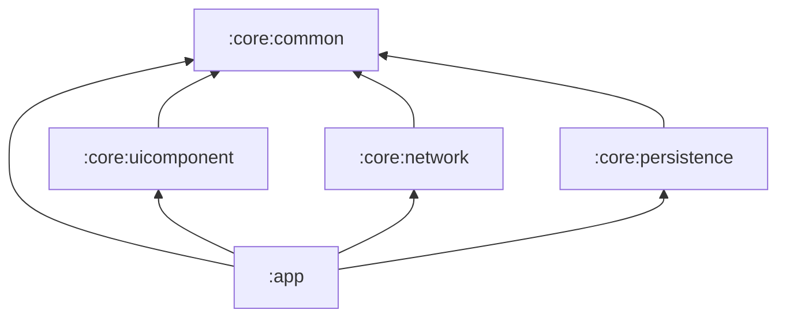
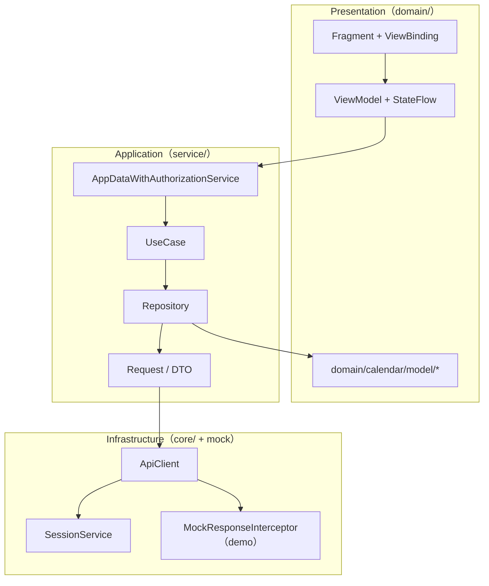
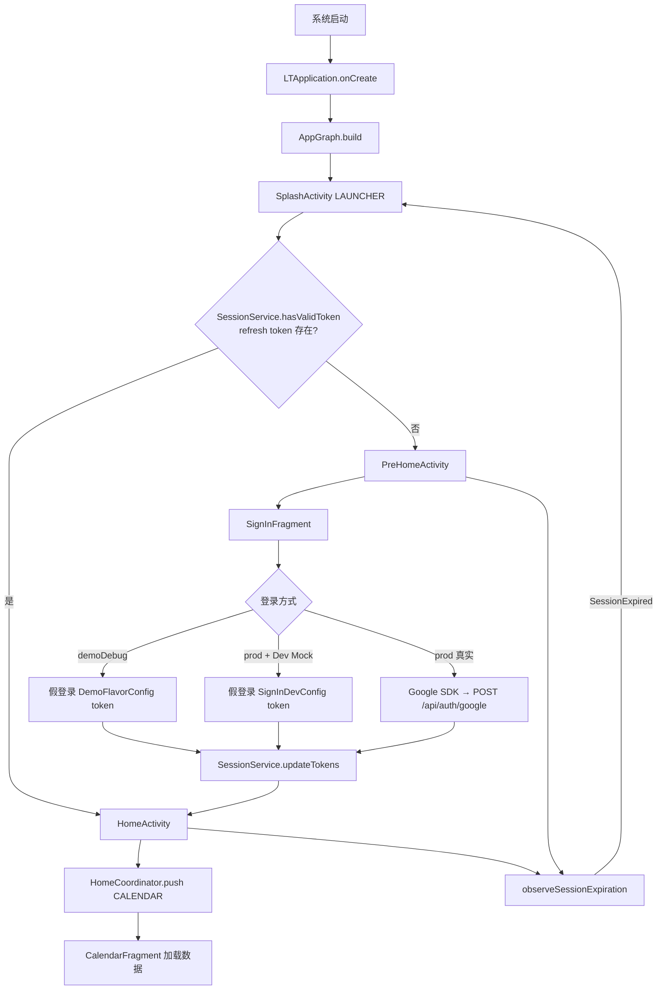

# Little Things Android

Android 客户端，镜像 iOS `LittleThingsApp` 架构。当前 v1 已交付：**Google 登录 → Token 持久化 → Home 四 Tab 壳层 → Calendar 全链路（Phase A–D）**，并支持 **demo 离线包**（零 HTTP）。

**设计文档：**

- [架构设计](docs/superpowers/specs/2026-07-05-littlethings-android-architecture-design.md)
- [Home Shell 设计](docs/superpowers/specs/2026-07-05-android-home-shell-design.md)
- [Calendar 设计](docs/superpowers/specs/2026-07-05-android-calendar-design.md)
- [Demo Mock 设计](docs/superpowers/specs/2026-07-05-android-demo-mock-data-design.md)
- [启动流程详解](docs/app-startup-flow.md)

---

## 1. 总体定位

| 项 | 选择 |
|----|------|
| UI | XML + ViewBinding 为主（Compose BOM 已引入，待用） |
| 架构 | MVVM + Coordinator + 手动 DI（`AppGraph`） |
| 接口参考 | iOS `Service/` 目录（不依赖 `flutter_framework` / `LTApp-BE`） |
| 构建变体 | `prod` / `demo` 两个 Product Flavor |

---

## 2. Gradle 模块结构

```
LittleThingsAndroidAI/
├── app/                          # 应用层：Activity、Domain、Service
├── core/
│   ├── common/                   # 环境、日志、FeatureToggle、InjectionValues
│   ├── network/                  # ApiClient、HTTP 抽象、UniversalResponse
│   ├── persistence/              # SessionService、Token 加密存储
│   └── uicomponent/              # LtHomeTabBar、AppColors 等共享 UI
├── settings.gradle.kts
└── docs/                         # 设计文档、启动流程说明
```

### 依赖方向（只向内）



| 模块 | 职责 | 主要类 |
|------|------|--------|
| `:core:common` | 跨层基础设施 | `AppEnvironment`, `FeatureToggle`, `InjectionValues`, `LTLog` |
| `:core:network` | HTTP 客户端 | `ApiClient`, `ApiRequest`, `EndPoint`, `UniversalResponse`, `RetryInterceptor` |
| `:core:persistence` | Token 持久化 | `SessionService`, `SecureTokenStorage`, `TokenProvider` |
| `:core:uicomponent` | 共享 UI 组件 | `LtHomeTabBar`, `HomeTabItem`, `AppColors` |
| `:app` | 全部业务 | 见 §4 |

### Product Flavor

| Variant | `USE_OFFLINE_MOCK` | applicationId | 说明 |
|---------|-------------------|---------------|------|
| `prodDebug` / `prodRelease` | `false` | `com.littlethingsandroidai` | 真实网络 + 拦截器链 |
| `demoDebug` / `demoRelease` | `true` | `com.littlethingsandroidai.demo` | 本地 assets mock，零 HTTP |

在 Android Studio：**View → Tool Windows → Build Variants** → `:app` 选择 `prodDebug` 或 `demoDebug`。

---

## 3. `:app` 内部分层

`:app` 模块内再分为三层，对齐 iOS `Domain` / `Service` / `App`：

```
app/src/main/kotlin/com/littlethingsandroidai/
├── app/              # 进程入口、Activity、Coordinator、DI
├── domain/           # UI（Fragment）+ ViewModel + 领域模型
└── service/          # Repository、UseCase、Request/DTO、Interceptor
```



### 设计原则

| 层级 | 职责 | 禁止 |
|------|------|------|
| **domain/** | UI 渲染、用户交互、状态观察 | 直接发 HTTP、直接读 SharedPreferences |
| **service/** | API 对接、DTO→Domain 映射、UseCase 编排 | 持有 View/Fragment 引用 |
| **app/** | 全局 wiring、Activity 路由、Session 监听 | 业务逻辑 |
| **core/** | 与业务无关的基础设施 | 引用 domain/service |

---

## 4. 各模块组成结构

### 4.1 `app/` — 应用壳层

| 文件/目录 | 作用 |
|-----------|------|
| `LTApplication.kt` | 进程入口，`AppGraph.build(context, AppEnvironment.RELEASE)` |
| `AppGraph.kt` | 手动 DI 容器，构建全部核心依赖 |
| `SplashActivity.kt` | 唯一 LAUNCHER，按 Session 路由 |
| `SessionExpirationObserver.kt` | 全局 Session 过期 → 重启 Splash |
| `prehome/PreHomeActivity.kt` | 登录前 Activity（NavHost） |
| `prehome/PreHomeCoordinator.kt` | PreHome 路由（v1 仅 LOGIN 可用） |
| `home/HomeActivity.kt` | 主界面：ViewPager2 四 Tab + 底部 TabBar |
| `home/HomeCoordinator.kt` | Tab 切换协调 |
| `home/UserHomeCoordinator.kt` | User Tab 子路由（占位） |

### 4.2 `domain/` — 表现层

| 目录 | 内容 | 状态 |
|------|------|------|
| `signin/` | `SignInFragment`, `SignInViewModel`, `SignInDevConfig` | ✅ 完整 |
| `calendar/` | 月历主屏 + 全部 Adapter/Binder | ✅ Phase A–D |
| `calendar/detail/` | `ReflectionDetailFragment`, `ReflectionDetailViewModel` | ✅ Phase C |
| `calendar/model/` | `CalendarDay`, `CalendarMonth`, `Answer`, `Question`, `Icon` | ✅ |
| `home/` | `HomeTabAdapter`, `PlaceholderTabFragment` | Calendar 已实现，其余占位 |
| `coordinator/` | `Route`, `Coordinator`, `PreHomeRoute`, `HomeRoute` | ✅ 路由枚举 |

**Calendar 模块文件：**

| 组件 | 文件 | 职责 |
|------|------|------|
| 主屏 | `CalendarFragment.kt` | ViewModel、ViewPager、MonthPicker、TodayQuestion 浮层 |
| 状态 | `CalendarViewModel.kt` | 月份生成、数据拉取、MonthPicker、QoD、markRead |
| 月 Pager | `CalendarMonthPagerAdapter.kt` | 横向切月 |
| 日格 | `CalendarDayGridAdapter.kt` | 7 列日期格 |
| MonthPicker | `CalendarMonthPickerAdapter.kt` | 年月选择列表 |
| Stamp 布局 | `CalendarStampBinder.kt` | 1/2/3/4+ stamp 布局 + Coil 加载 |
| 详情 | `ReflectionDetailFragment.kt` | 反思详情页（child Fragment 栈） |

### 4.3 `service/` — 应用服务层

```
service/
├── AppDataWithAuthorizationService.kt    # UseCase 门面（对齐 iOS）
├── AppDataWithoutAuthorizationService.kt # 无鉴权服务（refresh token）
├── DefaultEndPoint.kt                    # API 路径定义
├── auth/
│   ├── request/AuthRequest.kt
│   ├── repository/AuthRepository.kt, SessionDataRepository.kt
│   └── usecase/AuthUseCase.kt, RefreshTokenUseCase.kt
├── reflection/
│   ├── request/ReflectionRequest.kt
│   ├── dto/CalendarDayDto.kt
│   ├── repository/ReflectionRepository.kt
│   └── usecase/CalendarReflectionsUseCase.kt, FetchTodayQuestionsUseCase.kt
├── icon/
│   ├── request/IconRequest.kt
│   ├── dto/IconReadResultDto.kt
│   ├── repository/IconRepository.kt
│   └── usecase/MarkIconReadUseCase.kt
├── interceptor/
│   ├── AuthInterceptor.kt
│   ├── RefreshTokenInterceptor.kt
│   ├── LogoutInterceptor.kt
│   └── SessionEvents.kt
├── mock/                                 # demo flavor 专用
│   ├── MockResponseInterceptor.kt
│   ├── MockCalendarViewFilter.kt
│   ├── MockAssetLoader.kt
│   └── DemoFlavorConfig.kt
└── network/SSLPinningValidator.kt        # SSL Pinning 预留
```

**`AppDataWithAuthorizationService` 已实现的 UseCase：**

| UseCase | API | 状态 |
|---------|-----|------|
| `authUseCase` | POST `/api/auth/google` | ✅ |
| `calendarReflectionsUseCase` | GET `/api/calendar-view` | ✅ |
| `fetchTodayQuestionsUseCase` | GET `/api/questions-of-the-day` | ✅ |
| `markIconReadUseCase` | POST `/api/answers/icons/{id}/read` | ✅ |
| `submitAnswerUseCase` | — | ❌ 占位 |
| `fetchCategoriesUseCase` | — | ❌ 占位 |

---

## 5. 页面启动流程

### 5.1 冷启动总览



### 5.2 Activity 职责

| Activity | 触发条件 | UI 结构 |
|----------|----------|---------|
| `SplashActivity` | LAUNCHER | 无 UI 停留，纯路由 |
| `PreHomeActivity` | 无 refresh token | `NavHostFragment` → `SignInFragment` |
| `HomeActivity` | 有 refresh token | `ViewPager2`（4 Tab）+ `LtHomeTabBar` |

### 5.3 Home Tab 现状

| Index | Route | Fragment | 状态 |
|-------|-------|----------|------|
| 0 | `CALENDAR` | `CalendarFragment` | ✅ 完整 |
| 1 | `THREAD` | `PlaceholderTabFragment` | 占位 |
| 2 | `INSIGHTS` | `PlaceholderTabFragment` | 占位 |
| 3 | `USER` | `PlaceholderTabFragment` | 占位 |

### 5.4 Calendar 内导航

Calendar 在 `CalendarFragment` 内用 **child FragmentManager** 管理详情栈：

```
CalendarFragment
  ├── monthViewPager（横向切月）
  ├── monthPickerList（月份选择）
  ├── todayQuestionOverlay（今日问题浮层）
  └── detailContainer
        └── ReflectionDetailFragment（点击 stamp 后 push）
```

---

## 6. 数据流

### 6.1 依赖注入 — `AppGraph.build()`

**prod 拦截器链（从外到内）：**

```
AuthInterceptor → LogoutInterceptor → RefreshTokenInterceptor → RetryInterceptor → 网络
```

**demo 拦截器链：**

```
MockResponseInterceptor → RetryInterceptor（不 proceed，零 HTTP）
```

`AppGraph.build()` 构建顺序：

```
SessionService
  → bareApiClient / authenticatedApiClient（按 flavor 分支）
  → SessionDataRepository + AppDataWithoutAuthorizationService
  → DefaultReflectionRepository + DefaultIconRepository + DefaultAuthRepository
  → AppDataWithAuthorizationService
  → InjectionValues.register(FeatureToggle)
  → AppGraph.current = ...
```

### 6.2 登录数据流

```
SignInFragment
  → SignInViewModel.signInWithGoogle(idToken)     [真实]
  → SignInViewModel.signInWithMockGoogle()        [Dev Mock / Demo]
  → AuthUseCase.executeGoogleLogin()              [仅真实路径]
  → DefaultAuthRepository.googleLogin()
  → ApiClient → POST /api/auth/google
  → SessionService.updateTokens(access, refresh)
  → startActivity(HomeActivity) + finish()
```

**Token 存储策略：**

| Token | 存储 | 冷启动 |
|-------|------|--------|
| access | 内存 `@Volatile` | 丢失，靠 refresh 恢复 |
| refresh | `EncryptedSharedPreferences` | 持久化，`hasValidToken()` 依据 |

### 6.3 Calendar 数据流

```
CalendarFragment.onViewCreated
  → CalendarViewModel.generateMonths()
  → CalendarViewModel.scrollToCurrentMonth()
  → CalendarViewModel.fetchData()
  → CalendarReflectionsUseCase.execute(start, end)
  → ReflectionRepository.fetchCalendarReflections()
  → GET /api/calendar-view?start=&end=
  → 合并 reflections 到 CalendarMonth.days
  → CalendarStampBinder + Coil 渲染 stamp
```

**TodayQuestion（Phase D）：**

```
fetchTodayQuestions()
  → FetchTodayQuestionsUseCase
  → GET /api/questions-of-the-day
  → todayQuestions / showTodayQuestion StateFlow → UI 浮层
```

**Stamp 详情 + markRead（Phase C）：**

```
点击 stamp
  → markIconAsRead(answer) → POST /api/answers/icons/{id}/read
  → fetchData() 刷新
  → ReflectionDetailFragment（Coil 加载 icon.url）
```

### 6.4 Demo Mock 数据流

```
ApiClient.sendRequest()
  → MockResponseInterceptor.intercept()（不 chain.proceed()）
  → AndroidMockAssetLoader 读 app/src/demo/assets/mock/
  → calendar-view: MockCalendarViewFilter 按 start/end 过滤
  → 返回合成 JSON Response
```

| Method | Path | 数据源 |
|--------|------|--------|
| GET | `/api/calendar-view` | `demo/assets/mock/calendar/calendar_view.json` |
| GET | `/api/questions-of-the-day` | `demo/assets/mock/reflection/questions_of_the_day.json` |
| POST | `/api/answers/icons/{id}/read` | 内存合成成功响应 |

### 6.5 Session 过期

```
API 401 + refresh 失败
  → LogoutInterceptor → SessionService.clear()
  → SessionEvents.publish(SessionExpired)
  → observeSessionExpiration() → SplashActivity
```

---

## 7. 实现边界

| 已实现 | 未实现 / 占位 |
|--------|---------------|
| 双 Activity 启动 + Session 路由 | Onboarding / Welcome / FirstQuestion |
| Google Sign-In + Dev Mock + Demo 离线包 | Apple 登录 |
| Token 持久化 / 刷新 / 过期踢出 | — |
| Home 四 Tab 壳层 | Thread / Insights / User 业务 |
| Calendar 全链路（A–D） | 提交回答（Add stub 仅 UI） |
| Coil stamp + 详情页 + markRead | SSE 流式请求 |
| prod/demo Product Flavor | Compose Insights 页面 |

---

## 8. 构建与测试

```bash
# 构建（双 flavor）
./gradlew :app:assembleProdDebug :app:assembleDemoDebug

# 单元测试（双 flavor）
./gradlew :app:testProdDebugUnitTest :app:testDemoDebugUnitTest

# 安装 demo 离线包（飞行模式可用）
./gradlew :app:installDemoDebug

# 全量 core + app 测试
./gradlew testDebugUnitTest
```

APK 输出：

- `app/build/outputs/apk/prod/debug/app-prod-debug.apk`
- `app/build/outputs/apk/demo/debug/app-demo-debug.apk`

---

## 9. Google Sign-In 配置

Google Sign-In 需要在 Google Cloud Console 配置 Web Client ID 和 SHA-1 指纹。

### 1. 替换 Web Client ID

编辑 `app/src/main/res/values/strings.xml`：

```xml
<string name="default_web_client_id">YOUR_WEB_CLIENT_ID</string>
```

使用 [Google Cloud Console](https://console.cloud.google.com/) → APIs & Services → Credentials 中的 **Web client** OAuth 2.0 Client ID。

### 2. 注册 SHA-1 指纹

1. Google Cloud Console → 项目 → **APIs & Services** → **Credentials**
2. 选择（或创建）package name 为 `com.littlethingsandroidai` 的 **Android** OAuth 2.0 client
3. 添加 debug/release **SHA-1** 证书指纹

Debug SHA-1：

```bash
keytool -list -v -keystore ~/.android/debug.keystore -alias androiddebugkey -storepass android -keypass android
```

> **Dev Mock：** `SignInDevConfig.MOCK_GOOGLE_SIGN_IN = true` 时跳过 Google SDK 与后端，直接写入 mock token。  
> **Demo 离线包：** `demoDebug` variant 下勾选 Terms → Google 登录即写入 `DemoFlavorConfig` token，Calendar API 全部本地 mock。

---

## 10. 关键文件索引

```
app/src/main/kotlin/com/littlethingsandroidai/
├── app/LTApplication.kt              # 进程入口
├── app/AppGraph.kt                   # DI 中枢
├── app/SplashActivity.kt             # 路由分发
├── domain/signin/                    # 登录
├── domain/calendar/                  # 月历（主功能）
├── domain/home/HomeTabAdapter.kt     # Tab → Fragment 映射
├── service/AppDataWithAuthorizationService.kt
├── service/mock/MockResponseInterceptor.kt
└── service/interceptor/

app/src/demo/assets/mock/             # demo 离线数据
app/src/main/res/navigation/nav_prehome.xml

core/network/.../ApiClient.kt
core/persistence/.../SessionService.kt
core/uicomponent/.../LtHomeTabBar.kt
```

---

## 11. 与 iOS 对照

| Android | iOS |
|---------|-----|
| `LTApplication` + `AppGraph` | `AppDelegate` + `AppCoordinator` |
| `SplashActivity` | Splash 路由 |
| `PreHomeActivity` + NavHost | `PreHomeCoordinator` |
| `HomeActivity` + `HomeCoordinator` | `HomeCoordinator` + TabView |
| `CalendarFragment` + `CalendarViewModel` | Calendar View/ViewModel |
| `AppDataWithAuthorizationService` | 同名服务 |
| OkHttp 拦截器链 | Auth / Refresh / Logout Interceptor |
| `SessionService` | Keychain + 内存 access token |

---

## 12. Tech Stack

- Kotlin 2.2, AGP 9.1, compileSdk 37
- XML + ViewBinding（Compose BOM 保留待用）
- Navigation Component, OkHttp 4, kotlinx.serialization
- EncryptedSharedPreferences, Google Sign-In, Coil 3
- JUnit 4, MockWebServer
