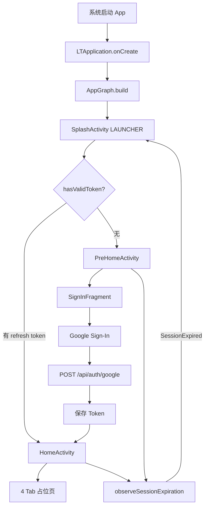

# Little Things Android — 启动加载流程

**日期：** 2026-07-05  
**适用版本：** v1（Auth 最小链路 + Home 占位）  
**相关文档：** [架构设计](superpowers/specs/2026-07-05-littlethings-android-architecture-design.md)

---

## 1. 总览

当前 v1 采用 **双 Activity 根架构**，对齐 iOS 的 PreHome / Home 分离：

| 阶段 | 组件 | 作用 |
|------|------|------|
| 进程启动 | `LTApplication` | 构建全局依赖图 `AppGraph` |
| 路由分发 | `SplashActivity` | 检查 Session，决定去向 |
| 未登录 | `PreHomeActivity` | 登录前流程（目前仅 SignIn） |
| 已登录 | `HomeActivity` | 主界面四 Tab（占位） |



---

## 2. 进程启动 — `LTApplication`

Manifest 注册自定义 Application：

```xml
<application android:name=".app.LTApplication" ...>
```

`LTApplication.onCreate()` 是整个 App 最先执行的初始化逻辑：

```kotlin
// app/src/main/kotlin/.../app/LTApplication.kt
class LTApplication : Application() {
    override fun onCreate() {
        super.onCreate()
        AppGraph.build(applicationContext, AppEnvironment.DEV)
    }
}
```

此时 **尚未进入任何 Activity**，但全局单例 `AppGraph.current` 已经就绪。

---

## 3. 依赖注入 — `AppGraph.build()`

`AppGraph` 是手动 DI 容器（对齐 iOS `AppCoordinator`），在启动时一次性构建所有核心依赖。

### 3.1 构建顺序

```
SessionService
  → bareApiClient（无鉴权）
  → SessionDataRepository + AppDataWithoutAuthorizationService
  → AuthInterceptor / LogoutInterceptor / RefreshTokenInterceptor
  → authenticatedApiClient（带拦截器链）
  → DefaultAuthRepository + AppDataWithAuthorizationService
  → InjectionValues.register(FeatureToggle)
  → AppGraph.current = ...
```

### 3.2 核心依赖

| 依赖 | 说明 |
|------|------|
| `SessionService` | Token 存储（access 内存 + refresh 加密持久化） |
| `bareApiClient` | 无鉴权 HTTP 客户端（用于 refresh token） |
| `authenticatedApiClient` | 带拦截器链的鉴权客户端 |
| `authRepository` / `AppDataWithAuthorizationService` | 登录等业务入口 |
| `FeatureToggle` | 功能开关注册到 `InjectionValues` |

### 3.3 拦截器链

OkHttp 拦截器注册顺序（从外到内）：

```
AuthInterceptor → LogoutInterceptor → RefreshTokenInterceptor → 网络
```

- **请求方向**：`AuthInterceptor` 附加 `Authorization: Bearer {accessToken}`
- **响应方向**：`RefreshTokenInterceptor` 先处理 401 并尝试 refresh；`LogoutInterceptor` 再判断是否触发登出

源码：`app/src/main/kotlin/.../app/AppGraph.kt`

---

## 4. 启动 Activity — `SplashActivity`

Manifest 中 `SplashActivity` 是唯一 LAUNCHER 入口：

```xml
<activity android:name=".app.SplashActivity" ...>
    <intent-filter>
        <action android:name="android.intent.action.MAIN" />
        <category android:name="android.intent.category.LAUNCHER" />
    </intent-filter>
</activity>
```

`SplashActivity` 不做 UI 停留，仅做 **Session 路由**：

```kotlin
val hasValidToken = AppGraph.current.sessionService.hasValidToken()
val destination = if (hasValidToken) HomeActivity::class.java else PreHomeActivity::class.java
startActivity(Intent(this, destination))
finish()
```

### 4.1 Session 判定逻辑

```kotlin
// core/persistence/.../SessionService.kt
override fun hasValidToken(): Boolean = !refreshToken.isNullOrBlank()
```

| Token 类型 | 存储位置 | 冷启动状态 |
|------------|----------|------------|
| access token | 内存（`@Volatile`） | 为 `null` |
| refresh token | `EncryptedSharedPreferences` | 可持久化 |

**冷启动仅检查 refresh token 是否存在。** 若存在则直接进入 `HomeActivity`，跳过登录页。首次鉴权 API 调用时，拦截器链会自动 refresh 获取 access token。

---

## 5. 未登录路径 — `PreHomeActivity` → `SignInFragment`

无 refresh token 时进入 `PreHomeActivity`：

```kotlin
val navHostFragment = supportFragmentManager.findFragmentById(R.id.prehomeNavHost) as NavHostFragment
coordinator = PreHomeCoordinator(navHostFragment.navController)
observeSessionExpiration()
```

Navigation Graph（`res/navigation/nav_prehome.xml`）当前只有一个页面：

```
startDestination = signInFragment
  └── SignInFragment（完整实现）
```

`PreHomeCoordinator` 已预留 iOS 对齐路由（Splash / Onboarding / Welcome / FirstQuestion），v1 均为空实现。

### 5.1 Google 登录链路

```
用户点击 Google 登录
  → 校验 Terms Checkbox
  → Google Sign-In SDK 获取 idToken
  → SignInViewModel.signInWithGoogle(idToken)
  → AuthUseCase.executeGoogleLogin()
  → DefaultAuthRepository.googleLogin()
  → POST /api/auth/google  { "idToken": "..." }
  → SessionService.updateTokens(access, refresh)
  → navigateToHome() → HomeActivity
  → finish PreHomeActivity
```

接口定义对齐 iOS `AuthRequest.swift`：

```kotlin
// service/auth/repository/AuthRepository.kt
override suspend fun googleLogin(idToken: String) {
    val request = AuthRequest.GoogleLogin(idToken = idToken)
    val response = apiClient.sendRequest(request)
    val loginInfo: UniversalResponse<LoginInfoDto> = response.parseJson()
    tokenProvider.updateTokens(
        accessToken = loginInfo.data.accessToken,
        refreshToken = loginInfo.data.refreshToken,
    )
}
```

---

## 6. 已登录路径 — `HomeActivity`

有 refresh token 时直接进入 `HomeActivity`：

```kotlin
binding.homeViewPager.adapter = HomeTabAdapter(this, tabs)
TabLayoutMediator(binding.homeTabLayout, binding.homeViewPager) { ... }.attach()
coordinator = HomeCoordinator(binding.homeViewPager, tabs)
userHomeCoordinator = UserHomeCoordinator()
observeSessionExpiration()
```

四个 Tab 路由：

| Tab | Route | v1 状态 |
|-----|-------|---------|
| Calendar | `HomeRoute.CALENDAR` | 占位 |
| Thread | `HomeRoute.THREAD` | 占位 |
| Insights | `HomeRoute.INSIGHTS` | 占位 |
| User | `HomeRoute.USER` | 占位 |

各 Tab 由 `PlaceholderTabFragment` 渲染简单占位 UI。

---

## 7. Session 过期 — 全局监听

`PreHomeActivity` 与 `HomeActivity` 均注册 Session 过期监听（`SessionExpirationObserver.kt`）：

```kotlin
SessionEvents.events.collect { event ->
    when (event) {
        SessionEvent.SessionExpired -> restartFromSplash()
    }
}
```

`restartFromSplash()` 清空 Task 栈，重新从 `SplashActivity` 开始。

### 7.1 触发条件（`LogoutInterceptor`）

- API 返回 **401** 且 refresh 失败
- 或 `RefreshTokenInterceptor` 标记响应头 `X-LT-Refresh-Failed: true`

触发后：`tokenProvider.clear()` → `SessionEvents.publish(SessionExpired)`

---

## 8. Token 刷新机制（运行时）

已登录用户发起鉴权 API 请求时的完整链路：

```
Request
  → AuthInterceptor：附加 Authorization: Bearer {accessToken}
  → LogoutInterceptor：透传
  → RefreshTokenInterceptor：发送请求
  ← 若 HTTP 401 且非重试请求：
       → RefreshTokenUseCase.execute()
       → SessionDataRepository.refreshToken()
       → POST refresh token（bareApiClient，无鉴权拦截器）
       → SessionService.updateTokens()
       → 重试原请求（带 X-LT-Retry 标记）
  ← LogoutInterceptor：
       若仍 401 或 X-LT-Refresh-Failed → clear + SessionExpired
```

Refresh 使用 **bareApiClient**，避免拦截器循环依赖。

---

## 9. v1 实现边界

| 已实现 | 占位 / 未实现 |
|--------|---------------|
| App 启动 + `AppGraph` DI | Onboarding / Welcome / FirstQuestion |
| Splash 路由分发 | Home 四 Tab 业务内容 |
| Google Sign-In 完整 UI | 除 Auth 外的 UseCase |
| Token 持久化 + 刷新 + 过期踢出 | Compose Insights 等 |

---

## 10. 关键文件索引

```
app/src/main/kotlin/com/littlethingsandroidai/
├── app/
│   ├── LTApplication.kt           # 进程入口，构建 AppGraph
│   ├── AppGraph.kt                  # 手动 DI
│   ├── SplashActivity.kt            # LAUNCHER，Session 路由
│   ├── SessionExpirationObserver.kt # Session 过期 → 重启 Splash
│   ├── prehome/
│   │   ├── PreHomeActivity.kt
│   │   └── PreHomeCoordinator.kt
│   └── home/
│       ├── HomeActivity.kt
│       ├── HomeCoordinator.kt
│       └── UserHomeCoordinator.kt
├── domain/
│   ├── signin/                      # SignInFragment + SignInViewModel
│   └── home/                        # HomeTabAdapter + PlaceholderTabFragment
└── service/
    ├── auth/                        # AuthRepository, AuthUseCase, AuthRequest
    └── interceptor/                 # Auth / RefreshToken / Logout

core/persistence/.../SessionService.kt   # Token 读写与 hasValidToken()
core/network/.../ApiClient.kt          # HTTP 客户端
app/src/main/res/navigation/nav_prehome.xml
app/src/main/AndroidManifest.xml
```

---

## 11. iOS 对照

| Android | iOS 等价 |
|---------|----------|
| `LTApplication` + `AppGraph.build` | `AppDelegate` + `AppCoordinator.init` |
| `SplashActivity` | Splash 路由逻辑 |
| `PreHomeActivity` + `PreHomeCoordinator` | `PreHomeCoordinator` + SwiftUI NavigationStack |
| `HomeActivity` + `HomeCoordinator` | `HomeCoordinator` + TabView |
| `SessionService` | Keychain + 内存 access token |
| 拦截器链 | `AuthInterceptor` / `RefreshTokenInterceptor` / `LogoutInterceptor` |
