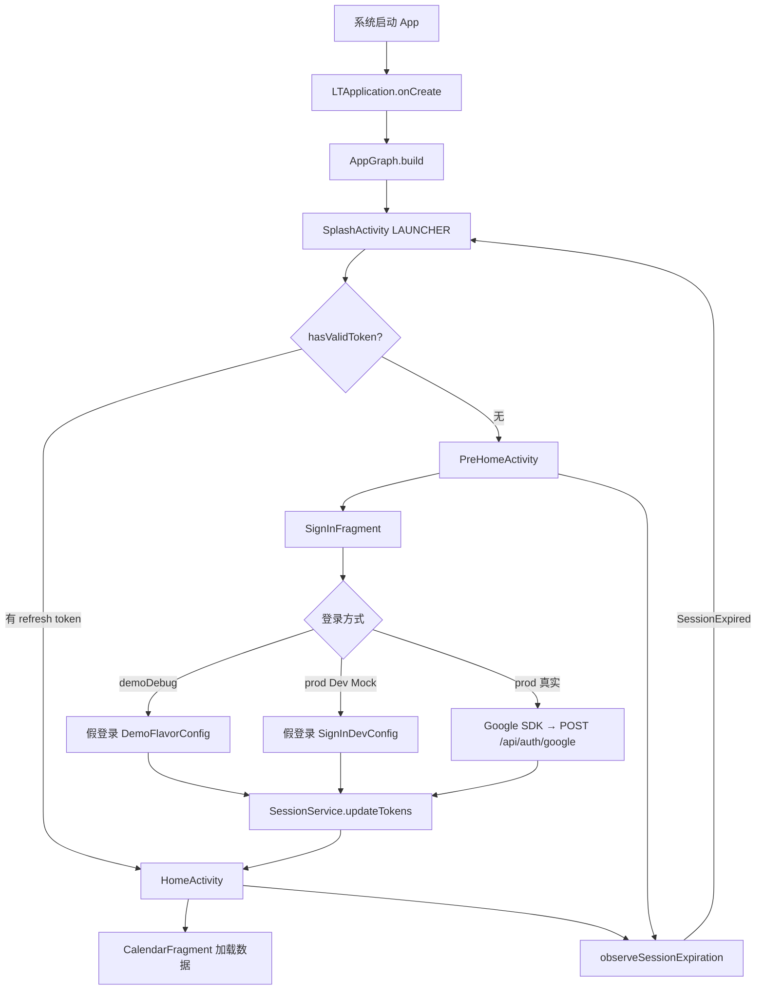

# Little Things Android — 启动加载流程

**日期：** 2026-07-05  
**适用版本：** v1（Auth + Home Shell + Calendar Phase A–D + Demo 离线包）  
**相关文档：**

- [工程 README](../README.md)
- [架构设计](superpowers/specs/2026-07-05-littlethings-android-architecture-design.md)
- [Calendar 设计](superpowers/specs/2026-07-05-android-calendar-design.md)
- [Demo Mock 设计](superpowers/specs/2026-07-05-android-demo-mock-data-design.md)

---

## 1. 总览

当前 v1 采用 **双 Activity 根架构**，对齐 iOS 的 PreHome / Home 分离：

| 阶段 | 组件 | 作用 |
|------|------|------|
| 进程启动 | `LTApplication` | 构建全局依赖图 `AppGraph` |
| 路由分发 | `SplashActivity` | 检查 Session，决定去向 |
| 未登录 | `PreHomeActivity` | 登录前流程（目前仅 SignIn） |
| 已登录 | `HomeActivity` | 主界面：底部胶囊 TabBar + Calendar（Phase A–D）+ 三 Tab 占位 |



---

## 2. 进程启动 — `LTApplication`

Manifest 注册自定义 Application：

```xml
<application android:name=".app.LTApplication" ...>
```

`LTApplication.onCreate()` 是整个 App 最先执行的初始化逻辑：

```kotlin
// app/src/main/kotlin/.../app/LTApplication.kt
class LTApplication : Application() {
    override fun onCreate() {
        super.onCreate()
        AppGraph.build(applicationContext, AppEnvironment.RELEASE)
    }
}
```

此时 **尚未进入任何 Activity**，但全局单例 `AppGraph.current` 已经就绪。

---

## 3. 依赖注入 — `AppGraph.build()`

`AppGraph` 是手动 DI 容器（对齐 iOS `AppCoordinator`），在启动时一次性构建所有核心依赖。

### 3.1 构建顺序（prod flavor）

```
SessionService
  → bareApiClient（无鉴权）
  → SessionDataRepository + AppDataWithoutAuthorizationService
  → AuthInterceptor / LogoutInterceptor / RefreshTokenInterceptor
  → authenticatedApiClient（带拦截器链）
  → DefaultAuthRepository
  → DefaultReflectionRepository + DefaultIconRepository
  → AppDataWithAuthorizationService
  → InjectionValues.register(FeatureToggle)
  → AppGraph.current = ...
```

### 3.2 构建顺序（demo flavor，`USE_OFFLINE_MOCK = true`）

```
SessionService
  → MockResponseInterceptor(AndroidMockAssetLoader)
  → bareApiClient + authenticatedApiClient（均只挂 mock 拦截器）
  → DefaultAuthRepository / ReflectionRepository / IconRepository
  → AppDataWithAuthorizationService
  → AppGraph.current = ...
```

demo 分支 **不创建** `AuthInterceptor` / `RefreshTokenInterceptor` / `LogoutInterceptor`（无网络 refresh 无意义）。

### 3.3 核心依赖

| 依赖 | 说明 |
|------|------|
| `SessionService` | Token 存储（access 内存 + refresh 加密持久化） |
| `bareApiClient` | 无鉴权 HTTP 客户端（prod：refresh token；demo：mock） |
| `authenticatedApiClient` | 鉴权业务 API 客户端 |
| `AppDataWithAuthorizationService` | UseCase 门面（Auth / Calendar / QoD / markRead） |
| `FeatureToggle` | 功能开关注册到 `InjectionValues` |

### 3.4 拦截器链（prod）

OkHttp 拦截器注册顺序（从外到内）：

```
AuthInterceptor → LogoutInterceptor → RefreshTokenInterceptor → RetryInterceptor → 网络
```

- **请求方向**：`AuthInterceptor` 附加 `Authorization: Bearer {accessToken}`
- **响应方向**：`RefreshTokenInterceptor` 先处理 401 并尝试 refresh；`LogoutInterceptor` 再判断是否触发登出

### 3.5 拦截器链（demo）

```
MockResponseInterceptor → RetryInterceptor（不 chain.proceed()，零 HTTP）
```

源码：`app/src/main/kotlin/.../app/AppGraph.kt`

---

## 4. 启动 Activity — `SplashActivity`

Manifest 中 `SplashActivity` 是唯一 LAUNCHER 入口：

```xml
<activity android:name=".app.SplashActivity" ...>
    <intent-filter>
        <action android:name="android.intent.action.MAIN" />
        <category android:name="android.intent.category.LAUNCHER" />
    </intent-filter>
</activity>
```

`SplashActivity` 不做 UI 停留，仅做 **Session 路由**：

```kotlin
val hasValidToken = AppGraph.current.sessionService.hasValidToken()
val destination = if (hasValidToken) HomeActivity::class.java else PreHomeActivity::class.java
startActivity(Intent(this, destination))
finish()
```

### 4.1 Session 判定逻辑

```kotlin
// core/persistence/.../SessionService.kt
override fun hasValidToken(): Boolean = !refreshToken.isNullOrBlank()
```

| Token 类型 | 存储位置 | 冷启动状态 |
|------------|----------|------------|
| access token | 内存（`@Volatile`） | 为 `null` |
| refresh token | `EncryptedSharedPreferences` | 可持久化 |

**冷启动仅检查 refresh token 是否存在。** 若存在则直接进入 `HomeActivity`，跳过登录页。prod 模式下首次鉴权 API 调用时，拦截器链会自动 refresh 获取 access token。

---

## 5. 未登录路径 — `PreHomeActivity` → `SignInFragment`

无 refresh token 时进入 `PreHomeActivity`：

```kotlin
val navHostFragment = supportFragmentManager.findFragmentById(R.id.prehomeNavHost) as NavHostFragment
coordinator = PreHomeCoordinator(navHostFragment.navController)
observeSessionExpiration()
```

Navigation Graph（`res/navigation/nav_prehome.xml`）当前只有一个页面：

```
startDestination = signInFragment
  └── SignInFragment（完整实现）
```

`PreHomeCoordinator` 已预留 iOS 对齐路由（Splash / Onboarding / Welcome / FirstQuestion），v1 均为空实现。

### 5.1 登录链路（三种模式）

`SignInFragment` 在 Terms 校验通过后按优先级分支：

```kotlin
when {
    BuildConfig.USE_OFFLINE_MOCK -> viewModel.signInWithMockGoogle()   // demo
    SignInDevConfig.MOCK_GOOGLE_SIGN_IN -> viewModel.signInWithMockGoogle()  // prod dev mock
    else -> signInLauncher.launch(googleSignInClient.signInIntent)     // 真实 Google
}
```

| 模式 | 触发条件 | Token 来源 | 网络 |
|------|----------|------------|------|
| **Demo 离线** | Build Variant = `demoDebug` | `DemoFlavorConfig` | 零 HTTP（mock 拦截器） |
| **Dev Mock** | `SignInDevConfig.MOCK_GOOGLE_SIGN_IN = true` | `SignInDevConfig` | 登录跳过；业务 API 仍走网络 |
| **真实登录** | 上述均为 false | POST `/api/auth/google` 响应 | 完整网络 |

**真实 Google 登录链路：**

```
用户点击 Google 登录
  → 校验 Terms Checkbox
  → Google Sign-In SDK 获取 idToken
  → SignInViewModel.signInWithGoogle(idToken)
  → AuthUseCase.executeGoogleLogin()
  → DefaultAuthRepository.googleLogin()
  → POST /api/auth/google  { "idToken": "..." }
  → SessionService.updateTokens(access, refresh)
  → navigateToHome() → HomeActivity
  → finish PreHomeActivity
```

接口定义对齐 iOS `AuthRequest.swift`：

```kotlin
// service/auth/repository/AuthRepository.kt
override suspend fun googleLogin(idToken: String) {
    val request = AuthRequest.GoogleLogin(idToken = idToken)
    val response = apiClient.sendRequest(request)
    val loginInfo: UniversalResponse<LoginInfoDto> = response.parseJson()
    tokenProvider.updateTokens(
        accessToken = loginInfo.data.accessToken,
        refreshToken = loginInfo.data.refreshToken,
    )
}
```

### 5.2 Demo 离线包（demoDebug）

- Build Variant: `demoDebug`
- `BuildConfig.USE_OFFLINE_MOCK = true`
- 安装包 ID: `com.littlethingsandroidai.demo`
- 数据来自 `app/src/demo/assets/mock/`，OkHttp `MockResponseInterceptor` 拦截，零 HTTP
- 命令: `./gradlew :app:installDemoDebug`
- Android Studio: **View → Tool Windows → Build Variants** → `:app` 选 `demoDebug`

---

## 6. 已登录路径 — `HomeActivity`

有 refresh token 时直接进入 `HomeActivity`：

- 背景色 `lt_oat`（`#FFFDF8`）
- `ViewPager2` 承载四 Tab Fragment（禁用手势滑动）
- 底部浮动 `LtHomeTabBar`（黑色胶囊，系统 icon 占位）切换 Tab
- 默认 Tab：Calendar

```kotlin
coordinator = HomeCoordinator(binding.homeViewPager, binding.homeTabBar, tabs)
coordinator.bind()
coordinator.push(HomeRoute.CALENDAR)
observeSessionExpiration()
```

四个 Tab 路由：

| Tab | Route | v1 状态 |
|-----|-------|---------|
| Calendar | `HomeRoute.CALENDAR` | **Phase A–D 已实现**（`CalendarFragment`） |
| Thread | `HomeRoute.THREAD` | 占位 |
| Insights | `HomeRoute.INSIGHTS` | 占位 |
| User | `HomeRoute.USER` | 占位 |

Tab 0 由 `CalendarFragment` 承载完整月历 UI；其余 Tab 仍由 `PlaceholderTabFragment` 渲染简单占位 UI。

### 6.1 Calendar Tab — Phase A–D

`HomeTabAdapter` index 0 为 `CalendarFragment`。登录后默认进入 Calendar Tab。

**UI 结构：**

| 区域 | 组件 | Phase | 说明 |
|------|------|-------|------|
| Header | `view_calendar_header` | A | 当前月/年标题；点击展开 MonthPicker；Today 回到当前月 |
| MonthPicker | `view_calendar_month_picker` | B | 年份分隔 + 月份列表；选中后切 ViewPager |
| Weekday | `view_calendar_weekday_row` | A | 7 列星期标题；未来月整行置灰 |
| 月历主体 | `SwipeRefreshLayout` + 横向 `ViewPager2` | A/B | 下拉刷新；左右滑动切月；未来月 monthLock |
| 日格 Grid | `RecyclerView` + `GridLayoutManager(7)` | A | `CalendarDayGridAdapter` 渲染日期格 |
| Stamp | `CalendarStampBinder` | C | Coil 加载 1/2/3/4+ stamp 布局 |
| Footer | `monthFooter` | A | 当月反思数量文案 |
| TodayQuestion | 浮层 + Add stub | D | QoD 列表；展开更多；Add 按钮占位 |
| 详情 | `ReflectionDetailFragment` | C | child Fragment 栈，点击 stamp 进入 |

**Calendar 内导航（非 Navigation Component）：**

```
CalendarFragment
  ├── monthViewPager
  ├── monthPickerList
  ├── todayQuestionOverlay
  └── detailContainer
        └── ReflectionDetailFragment（childFragmentManager push）
```

**月历数据链路：**

```
CalendarFragment.onViewCreated
  → CalendarViewModel.generateMonths()
  → CalendarViewModel.scrollToCurrentMonth()
  → CalendarViewModel.fetchData()
  → CalendarReflectionsUseCase.execute(start, end)
  → ReflectionRepository.fetchCalendarReflections()
  → GET /api/calendar-view?start=&end=
  → 合并 reflections 到 CalendarMonth.days
  → CalendarStampBinder + Coil 渲染 stamp
```

**TodayQuestion 数据链路（Phase D）：**

```
CalendarFragment.onViewCreated
  → CalendarViewModel.fetchTodayQuestions()
  → FetchTodayQuestionsUseCase.execute()
  → ReflectionRepository.fetchTodayQuestions()
  → GET /api/questions-of-the-day
  → todayQuestions / showTodayQuestion StateFlow → UI 浮层
```

**Stamp 详情 + markRead（Phase C）：**

```
用户点击 stamp
  → CalendarFragment.openReflectionDetail(answer)
  → CalendarViewModel.markIconAsRead(answer)   # 延迟 500ms
  → MarkIconReadUseCase.execute(iconId)
  → IconRepository → POST /api/answers/icons/{id}/read
  → fetchData() 刷新月历
  → childFragmentManager 打开 ReflectionDetailFragment
  → Coil 加载 icon.url（demo: file:///android_asset/mock/images/stamp_01.png）
```

ViewModel 通过 `CalendarViewModelFactory(AppGraph.current.appDataWithAuthorizationService)` 注入。

### 6.2 Demo Mock API 覆盖（v1）

| Method | Path | 行为 |
|--------|------|------|
| GET | `/api/calendar-view` | 读 `calendar_view.json`，按 `start`/`end` 内存过滤 |
| GET | `/api/questions-of-the-day` | 读 `questions_of_the_day.json` |
| POST | `/api/answers/icons/{id}/read` | 返回成功 JSON（v1 不反写 calendar `read_at`） |
| 其他 | — | 404 `Not mocked` |

---

## 7. Session 过期 — 全局监听

`PreHomeActivity` 与 `HomeActivity` 均注册 Session 过期监听（`SessionExpirationObserver.kt`）：

```kotlin
SessionEvents.events.collect { event ->
    when (event) {
        SessionEvent.SessionExpired -> restartFromSplash()
    }
}
```

`restartFromSplash()` 清空 Task 栈，重新从 `SplashActivity` 开始。

### 7.1 触发条件（`LogoutInterceptor`）

- API 返回 **401** 且 refresh 失败
- 或 `RefreshTokenInterceptor` 标记响应头 `X-LT-Refresh-Failed: true`

触发后：`tokenProvider.clear()` → `SessionEvents.publish(SessionExpired)`

> demo flavor 无 LogoutInterceptor，Session 过期逻辑不适用（无真实 401）。

---

## 8. Token 刷新机制（prod 运行时）

已登录用户发起鉴权 API 请求时的完整链路：

```
Request
  → AuthInterceptor：附加 Authorization: Bearer {accessToken}
  → LogoutInterceptor：透传
  → RefreshTokenInterceptor：发送请求
  ← 若 HTTP 401 且非重试请求：
       → RefreshTokenUseCase.execute()
       → SessionDataRepository.refreshToken()
       → POST refresh token（bareApiClient，无鉴权拦截器）
       → SessionService.updateTokens()
       → 重试原请求（带 X-LT-Retry 标记）
  ← LogoutInterceptor：
       若仍 401 或 X-LT-Refresh-Failed → clear + SessionExpired
```

Refresh 使用 **bareApiClient**，避免拦截器循环依赖。

---

## 9. v1 实现边界

| 已实现 | 占位 / 未实现 |
|--------|---------------|
| App 启动 + `AppGraph` DI（prod/demo 双 flavor） | Onboarding / Welcome / FirstQuestion |
| Splash 路由分发 | Thread / Insights / User Tab 业务内容 |
| Google Sign-In + Dev Mock + Demo 离线包 | Apple 登录 |
| Token 持久化 + 刷新 + 过期踢出（prod） | — |
| Home Calendar Tab Phase A–D | 提交回答（Add stub 仅 UI） |
| Coil stamp + 详情页 + markRead | SSE 流式请求 |
| TodayQuestion 浮层 + QoD API | Compose Insights 等 |

---

## 10. 关键文件索引

```
app/src/main/kotlin/com/littlethingsandroidai/
├── app/
│   ├── LTApplication.kt              # 进程入口，构建 AppGraph
│   ├── AppGraph.kt                   # 手动 DI（prod/demo 分支）
│   ├── SplashActivity.kt             # LAUNCHER，Session 路由
│   ├── SessionExpirationObserver.kt  # Session 过期 → 重启 Splash
│   ├── prehome/
│   │   ├── PreHomeActivity.kt
│   │   └── PreHomeCoordinator.kt
│   └── home/
│       ├── HomeActivity.kt
│       ├── HomeCoordinator.kt
│       └── UserHomeCoordinator.kt
├── domain/
│   ├── signin/                       # SignInFragment + SignInViewModel
│   ├── calendar/                     # CalendarFragment + ViewModel + Adapters
│   │   ├── detail/                   # ReflectionDetailFragment
│   │   └── model/                    # CalendarDay, Answer, Question, Icon
│   └── home/                         # HomeTabAdapter + PlaceholderTabFragment
└── service/
    ├── auth/                         # AuthRepository, AuthUseCase
    ├── reflection/                   # ReflectionRepository, CalendarReflectionsUseCase, FetchTodayQuestionsUseCase
    ├── icon/                         # IconRepository, MarkIconReadUseCase
    ├── mock/                         # MockResponseInterceptor, DemoFlavorConfig
    └── interceptor/                  # Auth / RefreshToken / Logout

app/src/demo/assets/mock/             # demo 离线 JSON + stamp 图片
core/persistence/.../SessionService.kt
core/network/.../ApiClient.kt
app/src/main/res/navigation/nav_prehome.xml
app/src/main/AndroidManifest.xml
```

---

## 11. iOS 对照

| Android | iOS 等价 |
|---------|----------|
| `LTApplication` + `AppGraph.build` | `AppDelegate` + `AppCoordinator.init` |
| `SplashActivity` | Splash 路由逻辑 |
| `PreHomeActivity` + `PreHomeCoordinator` | `PreHomeCoordinator` + SwiftUI NavigationStack |
| `HomeActivity` + `HomeCoordinator` | `HomeCoordinator` + TabView |
| `CalendarFragment` + `CalendarViewModel` | Calendar View/ViewModel |
| `SessionService` | Keychain + 内存 access token |
| 拦截器链 | `AuthInterceptor` / `RefreshTokenInterceptor` / `LogoutInterceptor` |
| `MockResponseInterceptor`（demo） | 无直接等价（iOS 可用类似 stub） |
